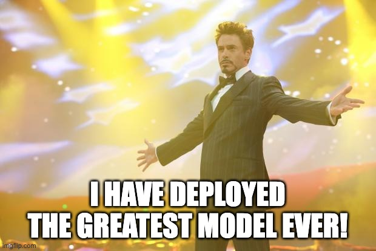
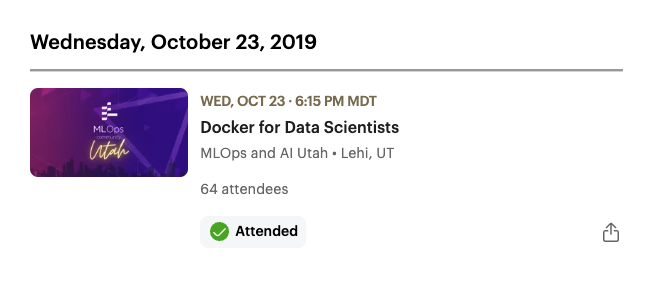
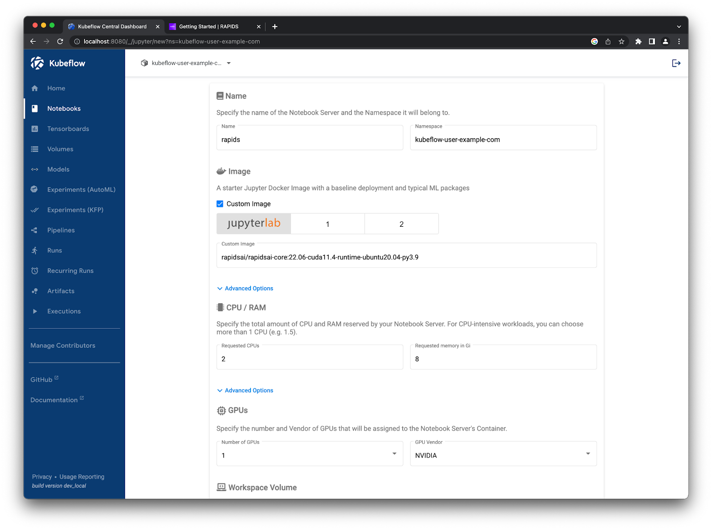
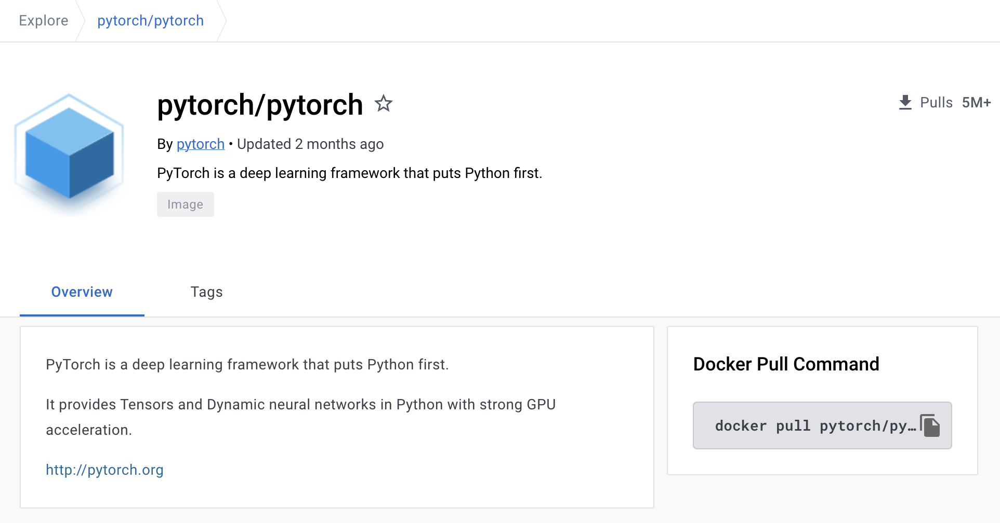

# What Do You Mean My ML Container is Vulnerable?

Ryan Russon
MLOps and AI Utah
May 2023

---

# "You've been working hard on training a great model"

<style>
img[alt~="center"] {
  display: block;
  margin: 0 auto;
}
</style>


---

## "Success!"

<style>
img[alt~="center"] {
  display: block;
  margin: 0 auto;
}
</style>



---

## "and then Cyber comes along..."

<style>
img[alt~="center"] {
  display: block;
  margin: 0 auto;
}
</style>


---

## "and then Cyber comes along..."

<style>
img[alt~="center"] {
  display: block;
  margin: 0 auto;
}
</style>


---

# The Rise of Containerized Applications

* **2006:** *Process Containers* was launched by Google for limiting, accounting and isolating resource usage
* **2008:** LinuX Containers (LXC) was the first, complete implementation of Linux container manager
* **2013:** Docker debuts to the public at PyCon 2013 in Santa Clara
* **2016:** The imporatance of container security is revealed
* **2017:** Mature container tools, `containerd` and `rkt` adopted by CNCF, and K8s grows up
* **2018:** App development via containerization becomes the "Gold Standard"


source: https://blog.aquasec.com/a-brief-history-of-containers-from-1970s-chroot-to-docker-2016

---

# Remember This?

> *"Eric Riddoch provided one of the best introductions to using Docker containers for Data Science"*



---

# Docker Images and Containers: Overview
* **Image:** The binary used as a ***blueprint*** for a specific runtime
* **Container:** The result when an ***image*** is deployed to an environment
* **Orchestrator:** A tool that allows the ***coordination, scheduling and communication*** of deployed containers (e.g. Kubernetes, ECS, Docker Swarm)

---



# Containerization in ML

* Exploratory Data Analysis ➡️ *Jupyter Notebook*
* Model Training ➡️ *PyTorch GPU acceleration*
* Batch Serving ➡️ *Running inference on a schedule*
* Real-time Inference ➡️ *Endpoint on the cloud*

---



# Popular ML Images
* `python`
* `pytorch/pytorch`
* `tensorflow/tensorflow`
* `jupyter/scipy-notebook`


---

# CVE?! What is this?

> "CVE, short for **Common Vulnerabilities and Exposures**, is a list of *publicly disclosed* computer security flaws" - *redhat.com*

---

# Vulnerability Scanning Tools

* Trivy
* AWS ECR
* GCP Container and Artifact Registry
* Docker Bench Security
* Clair

---

# Let's Scan Some Stuff!

Starting with a local scan using `trivy`
```
$ docker pull python:3.9.16
$ trivy image python:3.9.16 -o results.json -f "json"
```

---

# AWS ECR Scanner

---

# Docker Hub Scanner

---

# What Gives? 

Why do these scanners seem to all give different results?

https://www.youtube.com/watch?v=9weGi0csBZM

---

