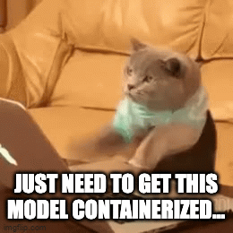
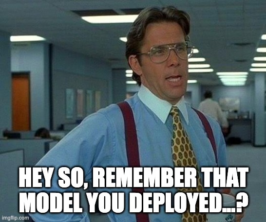

# What Do You Mean My ML Container is Vulnerable?

Ryan Russon
MLOps and AI Utah
May 2023

---

# "You've been working hard on training a great model"




---

## "Success!"


---

## "and then Cyber comes along..."



---

## "...and lets you know about some critical vulnerabilities"


---

## "You then might feel like this..."


---

# Our Journey 👟

* Brief history of the containerization of applications
* The lexicon
* Why containerization in ML?
* The dreaded "CVE"
* Tools and practices for maintaining ML images

---

# The Rise of Containerized Applications

* **2006:** *Process Containers* was launched by Google for limiting, accounting and isolating resource usage
* **2008:** LinuX Containers (LXC) was the first, complete implementation of Linux container manager
* **2013:** Docker debuts to the public at PyCon 2013 in Santa Clara
* **2016:** The importance of container security is revealed
* **2017:** Mature container tools, `containerd` and `rkt` adopted by CNCF, and K8s grows up
* **2018:** App development via containerization becomes the "Gold Standard"


source: https://blog.aquasec.com/a-brief-history-of-containers-from-1970s-chroot-to-docker-2016

---

# Remember This?

> *"Eric Riddoch provided one of the best introductions to using Docker containers for Data Science"*


---

# Docker Images and Containers: Overview
* **Image:** The binary used as a ***blueprint*** for a specific runtime
* **Container:** The result when an ***image*** is deployed to an environment
* **Orchestrator:** A tool that allows the ***coordination, scheduling and communication*** of deployed containers (e.g. Kubernetes, ECS, Docker Swarm)

---


# Containerization in ML

* Exploratory Data Analysis ➡️ *Jupyter Notebook*
* Model Training ➡️ *PyTorch GPU acceleration*
* Batch Serving ➡️ *Running inference on a schedule*
* Real-time Inference ➡️ *Endpoint on the cloud*

---


# Popular ML Images
* `python`
* `pytorch/pytorch`
* `tensorflow/tensorflow`
* `jupyter/scipy-notebook`


---

# CVE?! What is this?

> "CVE, short for **Common Vulnerabilities and Exposures**, is a list of *publicly disclosed* computer security flaws" - *redhat.com*

---

# Vulnerability Scanning Tools

* Trivy
* AWS ECR
* GCP Container and Artifact Registry
* Docker Scout
* Grype

---

# Let's Scan Some Stuff!

Starting with a local scan using `trivy`
```
$ docker pull python:3.9.16
$ trivy image python:3.9.16 --severity CRITICAL,HIGH,MEDIUM -o results.json -f "json"
$ python parse_trivy.py
```

---


---

# Trivy Results 😱

```
VULN TYPE    SEVERITY      COUNT
-----------  ----------  -------
LANG-PKGS    MEDIUM            1
OS-PKGS      CRITICAL         19
OS-PKGS      HIGH            235
OS-PKGS      MEDIUM          254
```

---

# But What About the Fixable Vulns?

```
$ docker pull python:3.9.16
$ trivy image --severity CRITICAL,HIGH,MEDIUM --ignore-unfixed python:3.9.16 -o .cache/results.json -f "json"
$ python parse_trivy.py
```


---


---

# Trivy Results (Only Fixable) 😑

```
VULN TYPE    SEVERITY      COUNT
-----------  ----------  -------
LANG-PKGS    MEDIUM            1
OS-PKGS      HIGH              9
OS-PKGS      MEDIUM            2
```

---

# Let's Fix the OS Vulns

> In theory, a simple OS upgrade should fix these

```docker
FROM python:3.9.16

RUN apt update
RUN apt dist-upgrade -y
```

---


---

# Survey Says...

```
VULN TYPE    SEVERITY      COUNT
-----------  ----------  -------
LANG-PKGS    MEDIUM            1
```

---

# What About the Library Vulns?

**CVE-2022-40897** 
```json
"Vulnerabilities": [
        {
          "VulnerabilityID": "CVE-2022-40897",
          "PkgName": "setuptools",
          "PkgPath": "usr/local/lib/python3.9/site-packages/setuptools-58.1.0.dist-info/METADATA",
          "InstalledVersion": "58.1.0",
          "FixedVersion": "65.5.1",
          ...
        }
```

---

# What About the Library Vulns?

```docker
FROM python:3.9.16

RUN apt update
RUN apt dist-upgrade -y

RUN python -m pip install --upgrade setuptools==65.5.1
```

---


---

# "Oh yeah!" 🥳

```bash
VULN TYPE    SEVERITY    COUNT
-----------  ----------  -------
```

---


# AWS ECR Scanner 🤔


---

# AWS ECR Scanner 😟


---

# Docker Hub Scanner


---

# What Gives? 🤷

> *"Why do the results of these different scanning systems differ in their results?*

---

# Security Scanners Aren't Created Equally...


> *From: "Malicious Compliance" https://www.youtube.com/watch?v=9weGi0csBZM*

---

# Where To From Here? 🏔️

---

# Standardize What Scans and Severity

* All scanners aren't the same, the organziation should align
* Risk tolerance: *"Do we allow medium vulns?"* 
* When do scans happen? 

---

# Scan Inside CI Pipelines


---

# Network Security

* Use security groups to control traffic to instances in your subnets
* Use *network access control lists* (ACLs) to control inbound and outbound traffic at the subnet level
* Manage access through Identity and Access Management (IAM)
* Use logging to monitor the IP traffic going to and from a VPC, subnet, or network interface
* Use a Network Access Analyzer to identify unintended network access to resources in our VPCs
* Use AWS Network Firewall to monitor and protect your network

source: https://docs.aws.amazon.com/vpc/latest/userguide/vpc-security-best-practices.html

---

# No `root` Access! ⚠️

> ❗Create an *"app"* user for your containers

```
FROM python:3.9.16
USER root
# Install stuff as root...
...

# Create the user
ARG USERNAME=user-name-goes-here
ARG USER_UID=1000
ARG USER_GID=$USER_UID
RUN groupadd --gid $USER_GID $USERNAME \
    && useradd --uid $USER_UID --gid $USER_GID -m $USERNAME \
# Give the user some permissions for specific directories...
...
# Set the new, default user
USER $USERNAME
```

---

# Remediation Process 🎯

* This is by far the toughest, but most important
* Some vulns are remediated by simple OS updates (e.g. `apt-get update`)
* Others require specific packages to be upgraded (e.g. `log4j`)
* This *can* break your entire environment! ...😏 malicious compliance?

---

# In Summary... 📑

* Standardize what scans your organize requires and risk tolerance 
* Set up CI pipelines to scan image builds for vulns
* Practice network security
    * *"Who can get to my container?"*
* Don't run containers as `root`
* What's the remediation process?
